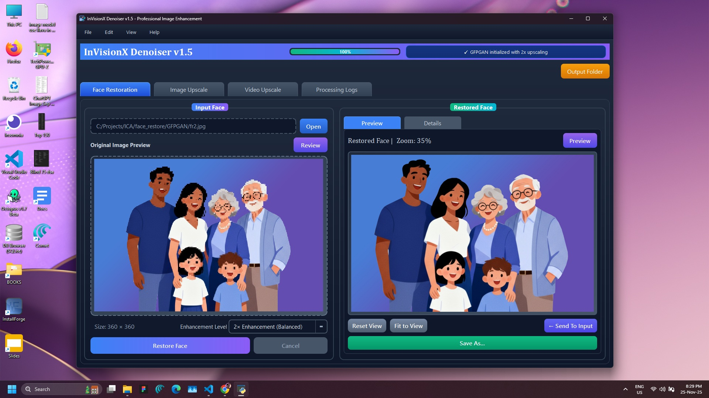
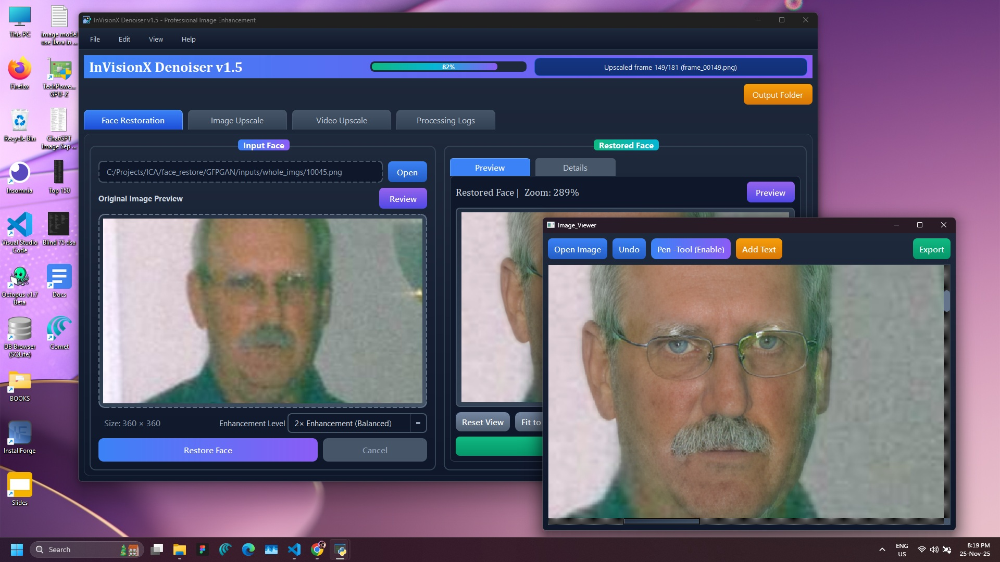
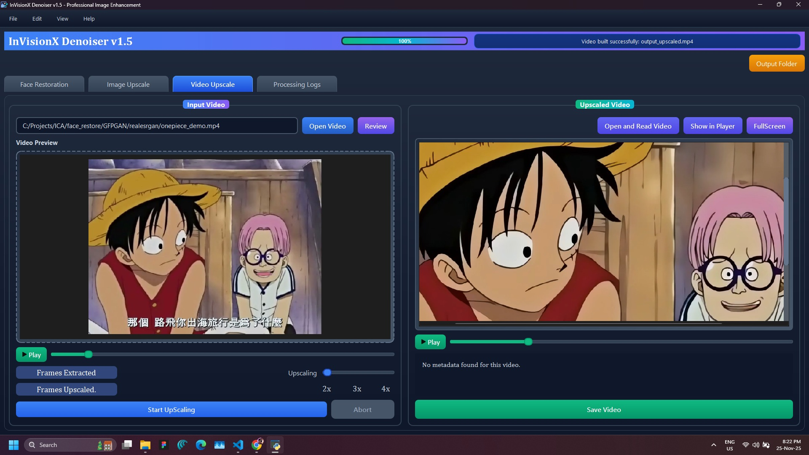
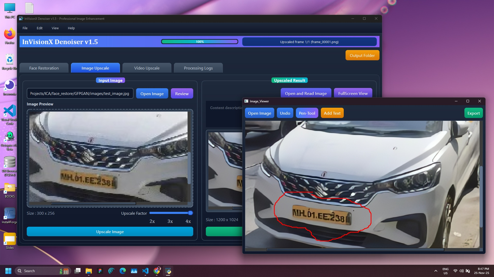
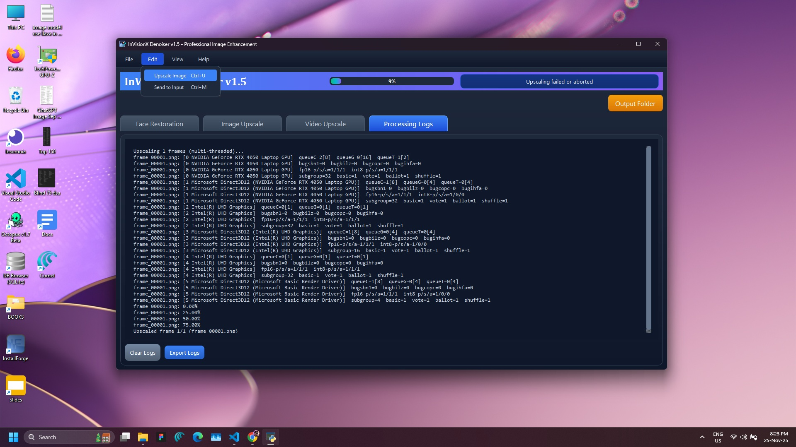

# InVisionX-Denoiser-Video-Image-Enhancer-Tool
A User-friendly Interface & Tool uses Real-ESRGAN AI Model as backend for high-quality image and video upscaling locally with AI-driven denoising.


## 📸 Project Insights

| Face Restoration Window | Video Upscaling Window |
|--------------|---------------|
|  |  |


| Image Enhancement with Inbuilt Overlay Markup | Project Log |
|--------------|---------------|
|  |  |


its a desktop variant application powered by Real-ESRGAN (Real-Enhanced Super-Resolution Generative Adversarial Network) AutoEncoder Model to generate real & high resolution results matches with given
low resolution image as input.

✨ Features
🚀 AI-based upscaling using Real-ESRGAN backend
🎥 Support for both images and videos
🔍 Zoom in/out and preview results before saving
🖥️ Clean and easy-to-use desktop interface
⚡ GPU acceleration for faster processing
📂 Save results in high-quality formats with a single click

🔧 Tech Stack
    
    Backend AI Model: Real-ESRGAN
    Frontend: PySide6 (Qt for Python)
    Languages: Python
    Dependencies: OpenCV, Ffmpeg
    Ffmpeg should intalled in computer and set as System-Env-path
    
📌 Use Cases
    
    Enhance old or low-resolution images
    Restore noisy/compressed pictures
    Upscale anime, artwork, or photos for printing
    Improve video clarity and sharpness
    
🚀 Getting Started
Clone this repository
Install dependencies (requirements.txt)
Run main.py to start the desktop application

### 🔧 Installation Requirements
This project requires **FFmpeg** (for video processing) and **OpenCV** (for image and video handling). Please follow the steps below to install them.

#### 📥 Install FFmpeg (Windows)
First install Pyside6 in python using:

    pip install PySide6
    

1. Download FFmpeg from the official builds:
   👉 [FFmpeg Download Page](https://www.ffmpeg.org/download.html)

2. Download the file: **ffmpeg-release-essentials.zip**.

3. Extract the ZIP to a folder, e.g. `C:\ffmpeg`.

4. Add FFmpeg to your **PATH**:

   * Press `Win + R`, type `sysdm.cpl`.
   * Go to **Advanced > Environment Variables**.
   * Under **System variables**, select `Path` → **Edit** → **New**.
   * Add:

         C:\ffmpeg\bin
     
           * Save and close.

5. Verify installation in Cmd:

       ffmpeg -version

   If you see version info, FFmpeg is installed successfully ✅


#### 📥 Install OpenCV (Python)

Run the following in your terminal (cmd, PowerShell, or VS Code terminal):
  
    pip install opencv-python


#### ✅ Quick Test

Check that both dependencies are working:

```bash
# Test OpenCV
import cv2
print(cv2.__version__)

# Test FFmpeg
# Run in command prompt:
ffmpeg -version
```

If both return version info, your setup is complete 🚀


🧠 About Real-ESRGAN
This project uses the public **Real-ESRGAN** trained model as backend for image and video-Frames upscaling and denoising.  
You can find the model repository here: [Real-ESRGAN GitHub](https://github.com/xinntao/Real-ESRGAN)


Real-ESRGAN (Real-Enhanced Super-Resolution Generative Adversarial Network) is an AI model designed for real-world image enhancement, capable of removing noise, restoring details, and producing natural high-resolution outputs.
Bring your images and videos back to life no need to prompt or genreate frames and extract then manuallu upscale and build etc, do this in just single button easliy and quickly with our InVisionX Denoiser user friendly Interface Tool.


